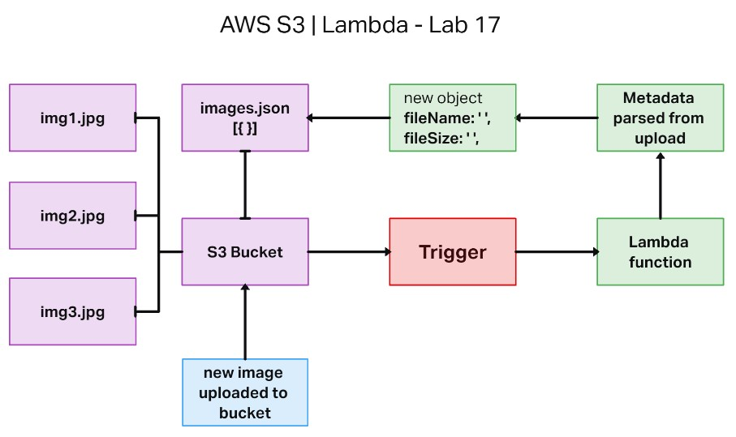
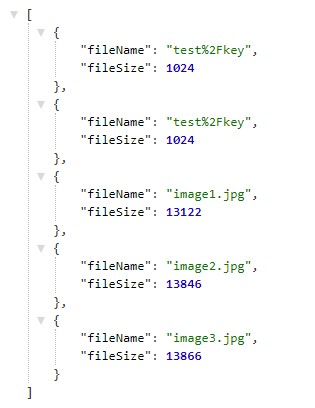
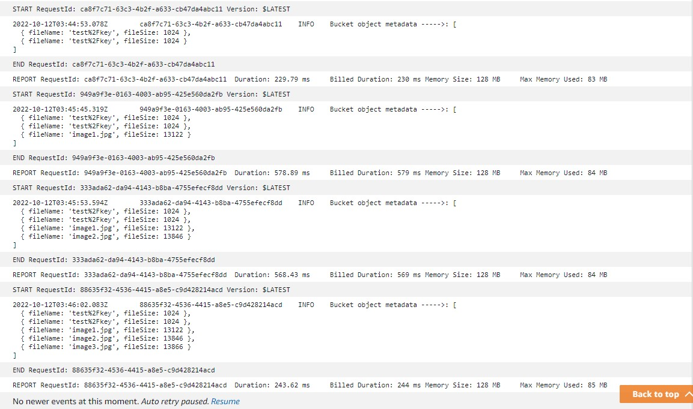

# image-lambda

## Code 401d48 lab 17

## Author: Robert Ball

Lab Collaboration with Elaine Huynh | Luis Rosales

**Live S3 Bucket | [images.JSON](https://rdball-lab17bucket.s3.us-west-2.amazonaws.com/images.json)**

---

### Problem Domain

* AWS Lambda allows writing code that is triggered in the cloud, without thinking about maintaining servers. We’ll use it today to automatically run some processing on image files after they’re uploaded to an S3 Bucket

---

### Requirements

Feature Tasks

* Create an S3 Bucket with “open” read permissions, so that anyone can see the images/files in their browser
* A user should be able to upload an image at any size, and update a dictionary of all images that have been uploaded so far
* When an image is uploaded to your S3 bucket, it should trigger a Lambda function which must:
  * Download a file called “images.json” from the S3 Bucket if it exists
  * The images.json should be an array of objects, each representing an image. Create an empty array if this file is not present
* Create a metadata object describing the image
  * name, Size, Type, etc.
* Append the data for this image to the array
  * Note: If the image is a duplicate name, update the object in the array, don’t just add it
  * Upload the images.json file back to the S3 bucket

---

Documentation:

Application UML



images.json format:

```JSON
{
  [ 
    {
    "fileName": "<uploaded file name>",
    "fileSize": <file size measured in kb>
    }
  ]
}
```

Explanation of images:

* Resulting array of objects seen when visiting images.json hosted on the S3 bucket:
  * The first two objects in the array were created while using the built in AWS Lambda console test feature



* Cloudwatch logs showing new files being uploaded to the S3 bucket.


